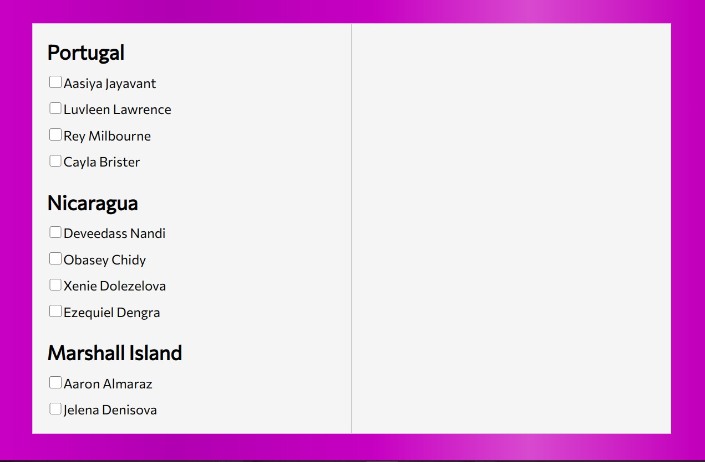
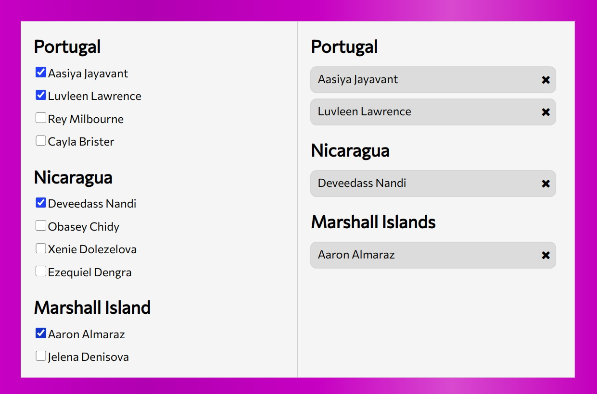
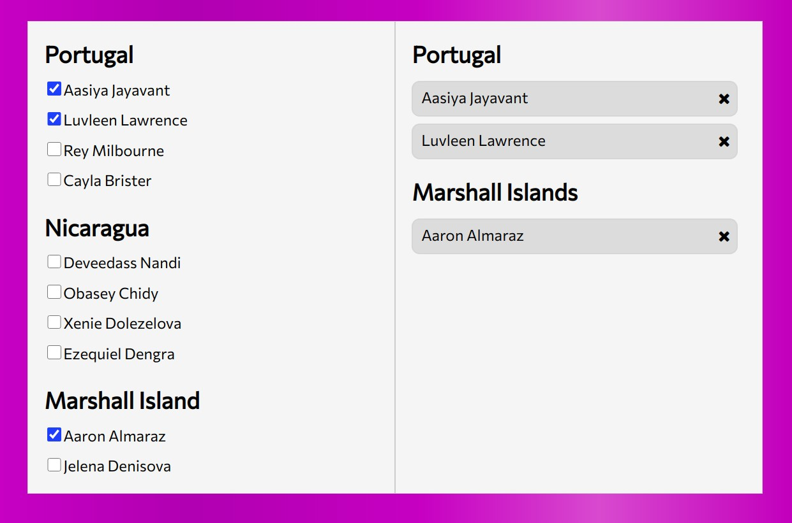
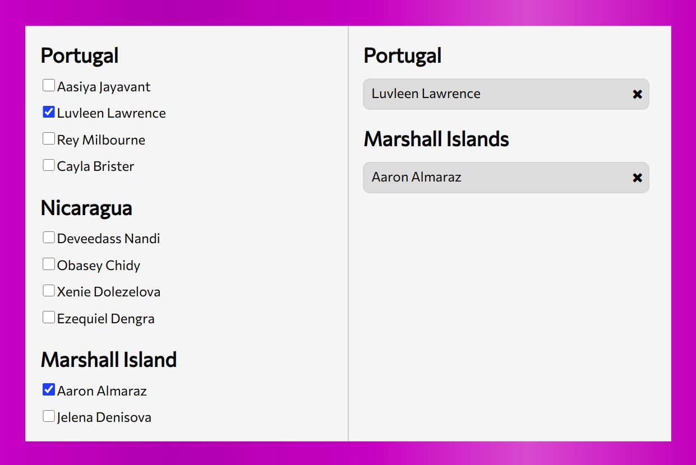

# Assignment

# Preview

Link :- https://spart-18-assignment.web.app/






# Techstack

### HTML, SCSS, React

# Instructions to install

1. Clone this repository from https://github.com/dheerajk7/spark-18-assignment.git .
2. Install NPM if you have not installed yet.
3. Go to project directory and run these commands

   #### To install node Modules

   ```
   npm install
   ```

   #### To run project

   ```
   npm start
   ```

4. Go and check at http://localhost:3000

# Directory Structure

`/` - all react app files <br>
`/src` - all react app code files <br>
`/src/components`- all react component files <br>
`/src/store`- redux store files <br>
`/src/actions`- all actions files <br>
`/src/reducers`- all reducers files <br>
`/src/styles` - all SCSS style files <br>

---
